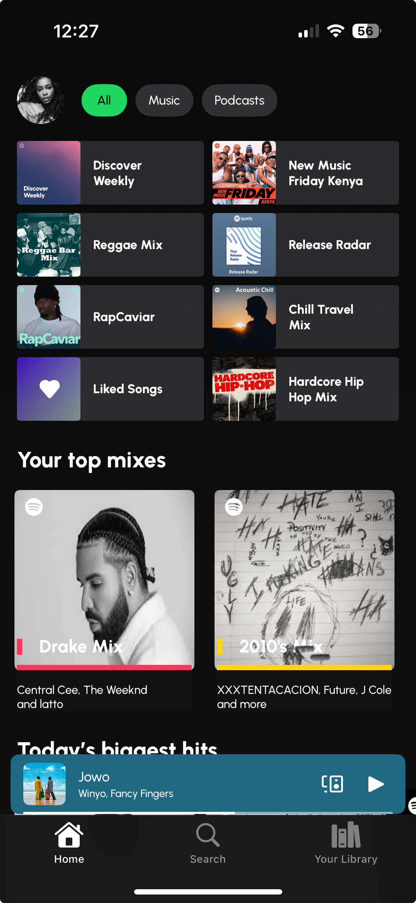
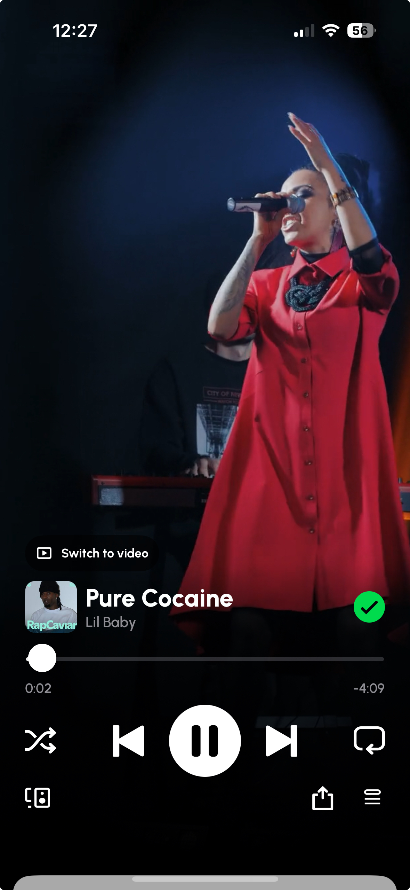
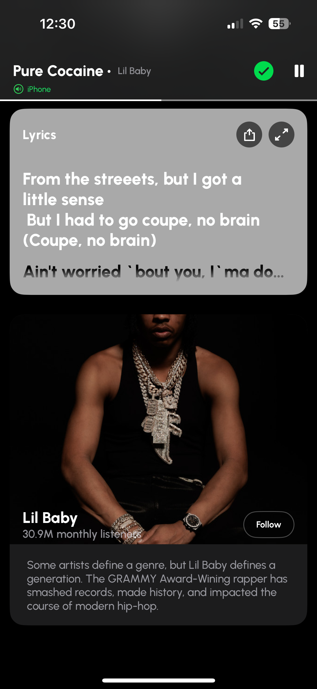

# Spotify

A Spotify UI clone Using Swift Ui

## **Screenshots 📷**
| | | |
|:-------------------------:|:-------------------------:|:-------------------------:|
| |  |  |

## **Demo 🎥**

https://github.com/user-attachments/assets/22d57a06-3ae6-43a8-b557-a32b68d42ca2

## TechStack 🛠️
- [Swift](https://developer.apple.com/swift/) - Swift is a powerful and intuitive programming language for all Apple platforms. It’s easy to get started using Swift, with a concise yet expressive syntax and modern features you’ll love. Swift code is safe by design and produces software that runs lightning-fast.
- [SwiftUI](https://developer.apple.com/documentation/swiftui/) - SwiftUI provides views, controls, and layout structures for declaring your app’s user interface. The framework provides event handlers for delivering taps, gestures, and other types of input to your app, and tools to manage the flow of data from your app’s models down to the views and controls that users see and interact with
- [TimberIOS](https://github.com/Felix-Kariuki/TimberIOS) - 

